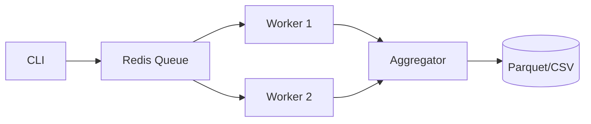
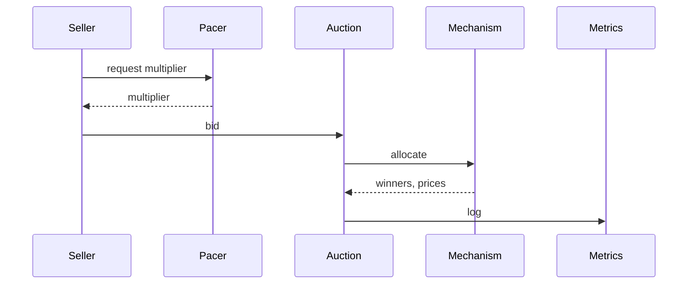

# Architecture Choices and Rationale

## Orchestration
Celery executes independent simulation chunks across workers.

## Broker
Redis is used for low-latency task queueing and as a simple result backend.

## Alternatives
RabbitMQ adds routing and strong delivery semantics with more ops overhead. Kafka is optimized for durable streams rather than task queues. Ray and Dask provide distributed actors and task graphs when you need shared in-memory state.

## Extra Diagrams

