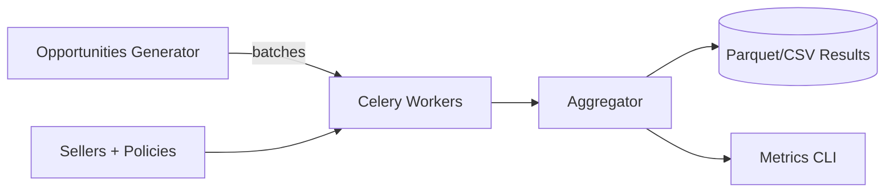
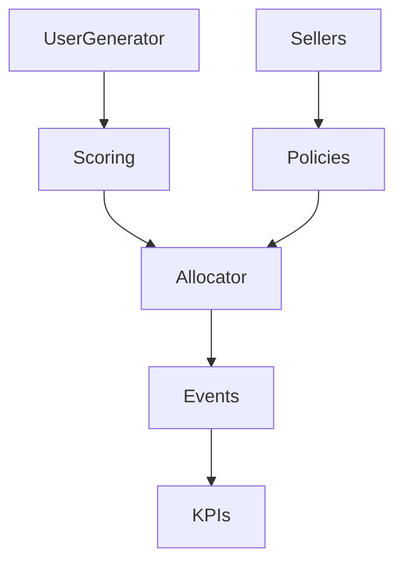
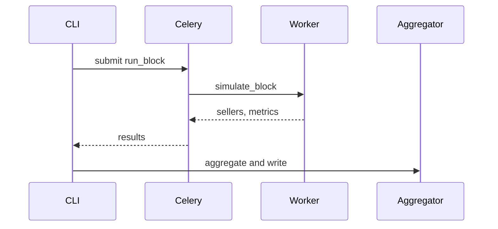

# Simulation Platform

This platform simulates multi-slot ad auctions with sellers, users, budgets, and automated bidding. It uses Celery + Redis for distributed execution.

## HLD

## LLD

## Sequence

## Tool Choices

Celery orchestrates independent chunks. Redis is the broker and backend to minimize ops. Alternatives like RabbitMQ provide advanced routing; Kafka suits durable logs. Ray/Dask are better for distributed in-memory arrays; here, tasks are IO-light and independent, so Celery+Redis is sufficient.

Config switches: `world.metrics.roas_mode` ∈ {value_over_spend, profit_over_spend}, `world.metrics.rocs_mode` ∈ {revenue_minus_cogs_over_spend, profit_after_cogs_over_spend}, `world.regulation.{min_quality,min_bid,reserve_cpc}`, and `world.slot_multipliers` for slot CTR curves.
